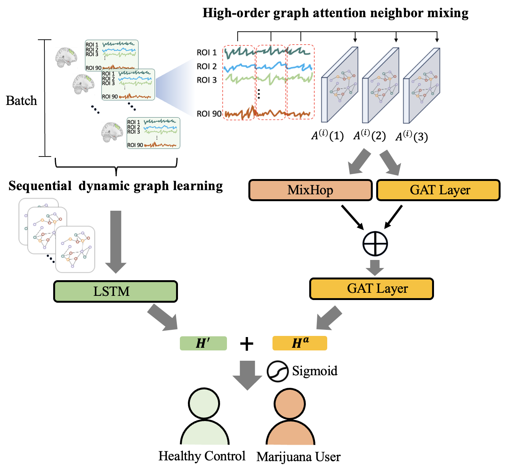

# Identification of Craving Maps among Marijuana Users via the Analysis of Functional Brain Networks with High-Order Attention Graph Neural Networks

# The dataset is open and available from previous author’s Kaustubh R research & Human Connectome Project (HCP) S1200:

Author’s Kaustubh R research: https://github.com/kulkarnik/cannabis-classifier

HCP dataset: https://www.humanconnectome.org/study/hcp-young-adult/data-releases

    

